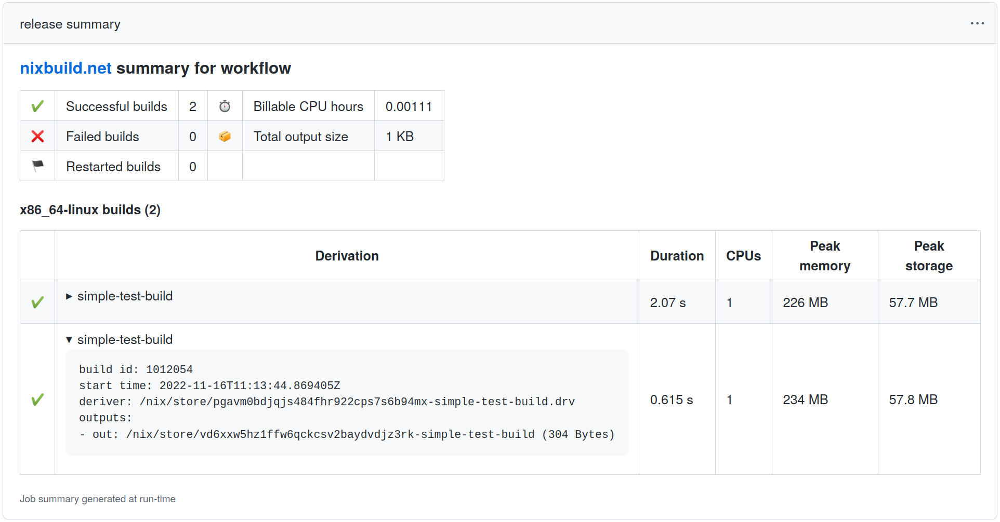

# nixbuild.net Action

This GitHub Action sets up [Nix](https://nixos.org/nix/) to use the
[nixbuild.net](https://nixbuild.net) service. It supports all Linux and MacOS
GitHub platforms. From either of those platforms, it can run **x86_64-linux**
and **aarch64-linux** Nix builds.

You need a [nixbuild.net](https://nixbuild.net) account to make use of this
action.

The configuration needed for this action is simple &ndash; you only need to
specify the SSH key used to authenticate your nixbuild.net account. You will
then automatically reap the benefits that nixbuild.net provides:

* Instead of having all Nix builds for a single GitHub job share the same two
  vCPUs, _each_ Nix build will get [up to 16 vCPUs](https://blog.nixbuild.net/posts/2020-06-25-automatic-resource-optimization.html).
  It doesn't matter how many concurrent Nix builds a job triggers, nixbuild.net
  will scale up automatically to avoid any slowdown.

* All Nix builds triggered from your nixbuild.net account can share their build
  results with each other. So, if you have multiple workflows triggering the
  same builds, each derivation will only be built once on nixbuild.net.  This
  works automatically, there is no need for configuring any binary caches, and
  you save time by not having to upload build results.

* Build result sharing also works outside GitHub Actions. You can use
  nixbuild.net from your development machine so that builds already performed
  by your GitHub workflows become available locally, or the other way around.
  Again, no extra configuration or binary caches are needed for this, just a
  [nixbuild.net account](https://docs.nixbuild.net/getting-started/)

* Builds that run on nixbuild.net work just as ordinary Nix builds, so you can
  still do whatever you want with the build results, like uploading to a
  separate binary cache.

See the nixbuild.net [FAQ](https://nixbuild.net/#faq) for more information
about the nixbuild.net service.

If you run into any problems using this action, or have feedback to share,
please open an issue on this repository or drop an email to
[support@nixbuild.net](mailto:support@nixbuild.net).


## Usage

This repository offers two different ways of running Nix builds with
nixbuild.net. You can use this repository as a normal GitHub Action, which lets
you use Nix in any way you like inside your workflow while all builds that Nix
runs are automatically offloaded to nixbuild.net. You need to install Nix in
some way (we'll get to this below), and then explicitly call `nix build` or
similar inside your workflow.

An even more convenient way is by using the [CI
Workflow](.github/workflows/ci-workflow.yml), which is a [reusable
workflow](https://docs.github.com/en/actions/using-workflows/reusing-workflows).
This workflow installs Nix, checks out your repository and evaluates a
`flake.nix` file found in it. It then automatically builds the derivations
found in `checks` or `packages` (or both). You can configure exactly which
derivations that should be built; by default all derivations in `checks` are
built. The individual derivations will be built by separate (concurrent) GitHub
Jobs which will give you a very nice overview over successful and failed builds
on GitHub's workflow result page. Care has been taken to run your builds in the
[most
performant](https://blog.nixbuild.net/posts/2022-03-16-lightning-fast-ci-with-nixbuild-net.html)
way possible.

If your project has a `flake.nix` file and you simply want to build your checks
or packages, we highly recommend you to use the CI Workflow. If you don't use
flakes or have more complex needs when it comes to evaluating and building
Nix expressions, use `nixbuild-action`.

### Prerequisites

1. Register for a [nixbuild.net account](https://nixbuild.net/#register).
   Every account includes free build hours, so you can try out this action
   without paying for anything.

2. Generate an [auth token](https://docs.nixbuild.net/access-control/#using-auth-tokens)
   using the nixbuild.net shell:

   ```
   $ ssh eu.nixbuild.net shell
   nixbuild.net> tokens create -p build:read -p build:write -p store:read -p store:write
   ```

   You can also provide a `--ttl-seconds` option to specify the token's expiration time.
   If you leave it out, the token will be valid for 1000 days.

3. Store your token as a [GitHub Secret](https://docs.github.com/en/actions/reference/encrypted-secrets)

4. Configure `nixbuild-action` to use the auth token secret like this:

   ```yaml
   uses: nixbuild/nixbuild-action@v23
   with:
     nixbuild_token: ${{ secrets.nixbuild_token }}
   ```


### Using the CI workflow

Call the reusable workflow like this:

```yaml
name: Examples
on: push
jobs:
  checks:
    uses: nixbuild/nixbuild-action/.github/workflows/ci-workflow.yml@v23
    secrets:
      nixbuild_token: ${{ secrets.nixbuild_token }}
```

You can configure the location of your `flake.nix` file, filter which
derivations to build, set nixbuild.net [settings](./#nixbuildnet-settings) and
more. Look at the [workflow definition](.github/workflows/ci-workflow.yml#L36)
to see how.

There is an [example workflow](.github/workflows/ci-example.yml) that uses the
CI workflow. You can see how the workflow runs look in the GitHub Actions UI
[here](https://github.com/nixbuild/nixbuild-action/actions/workflows/ci-example.yml).

The reusable CI workflow provides
[outputs](.github/workflows/ci-workflow.yml#L20) that lets you
[process](.github/workflows/ci-example.yml#L50) build results in a subsequent
job.

All build logs are automatically stored as workflow artifacts so you can
download them if needed. You can also see the build logs in the GitHub Actions
console UI.

### Using `nixbuild-action`

1. Install Nix with either
   [nixbuild/nix-quick-install-action](https://github.com/marketplace/actions/nix-quick-install)
   or [cachix/install-nix-action](https://github.com/marketplace/actions/install-nix).

2. Use `nixbuild/nixbuild-action` in your workflows. You don't need to configure
   anything else than your SSH key.

Now you can use Nix as you would normally do. `nixbuild-action` configures
nixbuild.net as a [remote
builder](https://docs.nixbuild.net/remote-builds/#using-remote-builders), which
means all builds will automatically be sent to nixbuild.net.

Here is a complete minimal workflow example:

```yaml
name: Examples
on: push
jobs:
  minimal:
    runs-on: ubuntu-20.04
    steps:
      - uses: actions/checkout@v3
      - uses: nixbuild/nix-quick-install-action@v34
      - uses: nixbuild/nixbuild-action@v23
        with:
          nixbuild_token: ${{ secrets.nixbuild_token }}
      - run: nix-build ...
```

#### Remote Store Building

For optimal build performance, especially on ephemeral instances like the GHA
runners, you should look into how to use [remote store
building](https://docs.nixbuild.net/remote-builds/#using-remote-stores).

In short, remote store building avoids having build inputs being downloaded to
the local machine (the GHA runner in this case). It also lets nixbuild.net make
more decisions on how the builds are scheduled.

There are a few issues around remote store building (both in Nix and in
nixbuild.net), which is why `nixbuild-action` doesn't default to it. However,
the [CI Workflow](/#using-the-ci-workflow) is using it successfully to get the
best build performance. If you want to try it out, you should use the following
options when invoking Nix:

```
nix build \
  --print-build-logs \
  --builders "" \
  --max-jobs 2 \
  --eval-store auto \
  --store ssh-ng://eu.nixbuild.net \
  ...
```

The above options works around issues with
[IFD](https://docs.nixbuild.net/remote-builds/#ifd-builds-import-from-derivation)
and missing build logs. Remote store building with nixbuild.net is only
possible using `nix build`, not `nix-build`, and you need to make sure you
specify the store URI using `ssh-ng://`, not `ssh://`.

When using remote store building, the final build result is not automatically
downloaded to the GHA runner (it will only exist in the remote store in
nixbuild.net). Often, you are mostly interested in seeing if the build succeeds
or not, so this is not an issue. However, if you actually need to use the build
result in your workflow you need to [explicitly fetch
it](https://docs.nixbuild.net/remote-builds/#retrieving-build-output-from-remote-stores).

You might see Nix output `don't know how to build these paths` when starting
a remote store build. You can ignore that output, as it doesn't mean anything is
wrong. There is an open Nix [issue](https://github.com/NixOS/nix/issues/8052)
about this.


### Generating Build Summaries

`nixbuild-action` can generate a summary of all builds that ran on nixbuild.net,
including information on how much CPU time that was consumed. You can generate
summaries for an individual job, or for the complete workflow. To generate a
summary for the job that uses `nixbuild-action`, configure it like this:

```yaml
- uses: nixbuild/nixbuild-action@v23
  with:
    nixbuild_token: ${{ secrets.nixbuild_token }}
    generate_summary_for: 'job'
```

To generate a summary for all builds that was executed during a complete
workflow, add a job that runs on the very end of the workflow, and configure
it like this:

```yaml
- uses: nixbuild/nixbuild-action@v23
  with:
    nixbuild_token: ${{ secrets.nixbuild_token }}
    generate_summary_for: 'workflow'
```

The build summaries look like this:



### nixbuild.net Settings

Optionally, you can configure [nixbuild.net
settings](https://docs.nixbuild.net/settings/) that you want your builds to
use. You do this using the `settings` action input.

The settings configured for this action is communicated to nixbuild.net through
the [SSH environment](https://docs.nixbuild.net/settings/#ssh-environment).
This means that any setting you set here will override your
[account](https://docs.nixbuild.net/settings/#account) settings.

If you want to disable the possibility to change any nixbuild.net settings
through GitHub Actions, you can set the
[settings-from-ssh-env](https://docs.nixbuild.net/settings/#settings-from-ssh-env)
setting to `false`. You need to change this setting from within the [nixbuild.net
shell](http://docs.nixbuild.net/nixbuild-shell/#configure-settings). If you do
that, any nixbuild.net setting configured for the action will be **ignored**.
Only settings configured for your nixbuild.net account will then be used.

An example workflow that turns on the
[reuse-build-timeouts](https://docs.nixbuild.net/settings/#reuse-build-timeouts)
setting:

```yaml
name: Examples
on: push
jobs:
  minimal:
    runs-on: ubuntu-20.04
    steps:
      - uses: actions/checkout@v3
      - uses: nixbuild/nix-quick-install-action@v34
      - uses: nixbuild/nixbuild-action@v23
        with:
          nixbuild_token: ${{ secrets.nixbuild_token }}
          settings: |
            reuse-build-timeouts = true
      - run: nix build ...
```

### nixbuild.net Enterprise Deployments

`nixbuild-action` can be used together with self-hosted enterprise deployments
of nixbuild.net like this:

```yaml
name: nixbuild.net Enterprise
on: push
jobs:
  minimal:
    runs-on: ubuntu-20.04
    steps:
      - uses: actions/checkout@v3
      - uses: nixbuild/nix-quick-install-action@v34
      - uses: nixbuild/nixbuild-action@v23
        with:
          nixbuild_token: ${{ secrets.nixbuild_token }}
          ssh_address: <IP or domain name of your nixbuild.net server>
          ssh_port: <SSH port>
          ssh_public_host_key: 'ssh-ed25519 ...'
          http_api_host: <IP or domain name of your nixbuild.net HTTP API>
          http_api_port: <HTTP port>
          http_api_scheme: <'http' or 'https'>
          http_api_subpath: '/api/v1'
      - run: nix build ...
```
